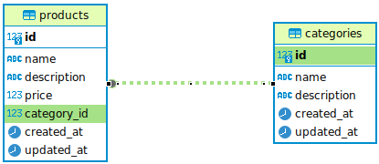

# Domain model metadata

## Actividad

1. Definir en readme o en un txt, los metadatos del modelo del dominio al cuál se la va a implementar el scaffolding. Ejemplo seleccionar una clase, de un dominio particular y documentarla. Que sea corta, máximo 2 o 3 atributos.

2. Crear una aplicación Go, que implemente un CRUD API, basado en los metadatos del modelo del dominio. Ejemplo, un CRUD API de una tabla o una clase particular. Y montarlo en GitHub.

Sugerencias:

Un archivo de rutas, GET /api/posts - me trae los todos posts (JSON). Ese archivo de rutas, por lo general define la ruta, y se asocia con un método de un controlador, o un método de un servicio dónde va la lógica de la implementación de la función.
Ese controlador, o método por lo general invoca internamente un modelo. Es donde tu defines la clase Post con sus atributos y al final el controlador retorna un (JSON)  Tomar como referencia. https://github.com/MVCBlogs/

3. Identificar si se cambia los metadatos del modelo del dominio, que líneas de código permanecen iguales y cuáles toca modificar (ejemplo si ya no es una clase post, si no una clase user).

## Resultado

1. Dominio: E-Commerce

    Product: (Id, Name, description, Price)

Domain model using class diagram notation

2. Ver repositorio.

3. ¿Que cambia en el código tras agregar la entidad Category?

- Debe considerarse la relación de las entidades (clases), de acuerdo a esto realizar los cambios necesarios en el modelo de datos.
- Debe crearse las llaves foráneas correspondientes (En caso de aplicar) o crear la tercera tabla donde se maneje la relación entre 2 entidades.
- Crear otros objetos de base de datos necesario. Ej Indices.
- Se sugiere siempre emplear el orden de las capas presentado para evitar conflictos en las importaciones.
- Tener presente que algunos fueron cambios y se pueden rastrear desde git diff pero otros son adición de nuevos archivos o porciones de código. 

### Database

- Se crea la tabla categories y llave foránea correspondiente en la tabla products.     **up.sql**

### Models

- Se agrega un modelo nuevo (Category) al struct de Models en models.go y a la función de inicialización de los modelos.   **internal/models/models.go**

- Se agrega un struct para Category y se implementan las funciones para el modelo de datos.   **internal/models/categories.go**

- En las funciones cambian los metadatos del modelo para cada operacion CRUD implementada (para structs, querys, parámetros de funciones, variables/slices).

### Handlers

- Se crea el archivo **handlers-category.go**

- Se crean los structs para la request y response correspondientes de acuerdo a la nueva entidad.

- Se crea el handler para manejar las request y responses asociadas a cada operación de la nueva entidad.

### Routes

- Se crean las rutas y se invoca su handler correspondiente de acuerdo a la operación a realizar.  **routes.go**

### Cambios puntuales en los archivos

Se pueden visualizar con el siguiente comando:

    git diff main feature/category-entity